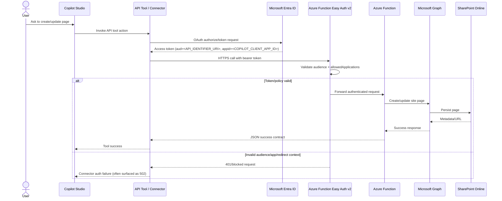

# Copilot Studio + Azure Function Easy Auth Alignment Runbook 

## Purpose
This runbook documents:
- what failed,
- why it failed,
- how it was fixed,
- how to configure it correctly from day one for future projects.

This public version is sanitized for sharing and uses placeholders for tenant/app/environment details.

## Placeholder key
- `<TENANT_ID>`
- `<SUBSCRIPTION_ID>`
- `<RESOURCE_GROUP>`
- `<FUNCTION_APP_NAME>`
- `<FUNCTION_HOSTNAME>`
- `<API_APP_NAME>`
- `<API_APP_CLIENT_ID>`
- `<COPILOT_CLIENT_APP_NAME>`
- `<COPILOT_CLIENT_APP_ID>`
- `<API_IDENTIFIER_URI>`
- `<CONNECTOR_NAME>`
- `<CONNECTOR_REDIRECT_URI>`

## Verified Identity Map (Template)

### Azure Function App
- **Function App name**: `<FUNCTION_APP_NAME>`
- **Host**: `<FUNCTION_HOSTNAME>`
- **State**: `Running`

### API App Registration used by Easy Auth
- **Application name**: `<API_APP_NAME>`
- **App (client) ID**: `<API_APP_CLIENT_ID>`
- **Identifier URI**: `<API_IDENTIFIER_URI>` (for example `api://<API_APP_CLIENT_ID>`)
- **Relevant scope**: `access_as_user`

### Copilot client app registration
- **Application name**: `<COPILOT_CLIENT_APP_NAME>`
- **App (client) ID**: `<COPILOT_CLIENT_APP_ID>`

## Root Cause (What went wrong)

The failure was caused by **identity misalignment**, not function business logic.

1. Function App Easy Auth policy allowed only one app in `allowedApplications`.
2. Copilot Studio called the API using tokens from a different client app.
3. Even with scope consent configured, Easy Auth rejected calls when caller app ID was not in `allowedApplications`.
4. Redirect URI mismatch in the connector/client app registration blocked or destabilized OAuth sign-in.

## Likely initial causes (opinion)

1. **Same-name identity assumption**
   - Similar display names across API app, Function App, and connector made it easy to assume IDs were aligned.

2. **Permission granted in one layer, blocked in another**
   - Delegated scope grant existed, but Easy Auth caller policy still denied the request.

3. **Connector redirect URI drift**
   - Connector-generated redirect URI was not exactly mirrored in client app registration.

4. **Delivery-first fallback masked auth issues**
   - Keeping `unauthenticatedClientAction = AllowAnonymous` can hide auth errors behind generic connector failures.

## Architecture sequence diagram



## Working fix pattern

Update Easy Auth v2 so Azure AD validation allows both:

- `allowedAudiences` includes `<API_IDENTIFIER_URI>`
- `defaultAuthorizationPolicy.allowedApplications` includes:
  - `<API_APP_CLIENT_ID>`
  - `<COPILOT_CLIENT_APP_ID>`

Temporary troubleshooting state (optional):
- `unauthenticatedClientAction = AllowAnonymous`

Recommended production state:
- `unauthenticatedClientAction = Return401`

## Build it correctly from the start (Step-by-step)

## Step 1: Create and expose the API app registration
1. Create app registration for the API (`<API_APP_NAME>`).
2. Set Application ID URI (`<API_IDENTIFIER_URI>`).
3. Expose delegated scope `access_as_user`.
4. Record API app ID and full scope URI.

## Step 2: Configure Function App Easy Auth to that API app
1. In Function App Authentication (v2), set Microsoft identity provider client ID to `<API_APP_CLIENT_ID>`.
2. Ensure allowed audience includes `<API_IDENTIFIER_URI>`.
3. Ensure allowed applications includes expected callers (at minimum `<COPILOT_CLIENT_APP_ID>`).

## Step 3: Create Copilot client app registration
1. Create app registration for Copilot client (`<COPILOT_CLIENT_APP_NAME>`).
2. Add delegated permission to API scope `access_as_user`.
3. Add exact redirect URI(s) used by Copilot Studio connector (`<CONNECTOR_REDIRECT_URI>`).
4. Grant admin consent.

## Step 4: Copilot Studio custom connector/API tool setup
1. Use OAuth 2.0 client ID = `<COPILOT_CLIENT_APP_ID>`.
2. Use scope = `<API_IDENTIFIER_URI>/access_as_user`.
3. Ensure exact redirect URI match between connector and app registration.
4. Recreate/refresh connection after any identity or auth change.

## Step 5: Verify before business logic tests
1. Confirm Easy Auth provider client ID equals `<API_APP_CLIENT_ID>`.
2. Confirm `allowedAudiences` contains `<API_IDENTIFIER_URI>`.
3. Confirm `allowedApplications` contains `<COPILOT_CLIENT_APP_ID>`.
4. Confirm delegated grants include `access_as_user`.
5. Test connector auth first, then payload behavior.

## Validation commands (public-safe templates)

Check Easy Auth v2:

```powershell
az webapp auth show --name <FUNCTION_APP_NAME> --resource-group <RESOURCE_GROUP> --only-show-errors --query "{providerClientId:properties.identityProviders.azureActiveDirectory.registration.clientId,allowedAudiences:properties.identityProviders.azureActiveDirectory.validation.allowedAudiences,allowedApplications:properties.identityProviders.azureActiveDirectory.validation.defaultAuthorizationPolicy.allowedApplications,unauthenticatedClientAction:properties.globalValidation.unauthenticatedClientAction}" -o json
```

Check API app registration:

```powershell
az ad app show --id <API_APP_CLIENT_ID> --query "{displayName:displayName,appId:appId,identifierUris:identifierUris,scopeValues:api.oauth2PermissionScopes[].value}" -o json
```

Check Copilot client app registration:

```powershell
az ad app show --id <COPILOT_CLIENT_APP_ID> --query "{displayName:displayName,appId:appId,redirectUris:web.redirectUris,requiredResourceAccess:requiredResourceAccess}" -o json
```

Check delegated grants:

```powershell
az ad app permission list-grants --id <COPILOT_CLIENT_APP_ID> -o json
```

## Quick troubleshooting checklist
1. Is token audience equal to `<API_IDENTIFIER_URI>`?
2. Is caller app ID in `allowedApplications`?
3. Is delegated scope consented (`access_as_user`) for the client app?
4. Is redirect URI exact and present in client app registration?
5. Was connector connection recreated after identity changes?

## One-page pre-go-live checklist

### A. Identity and naming alignment
- [ ] API app registration display name is documented and mapped to exact App ID.
- [ ] Function App name is documented and mapped to API app used by Easy Auth.
- [ ] Copilot client app display name is documented and mapped to exact App ID.
- [ ] No placeholder/historical IDs remain in connector or auth settings.

### B. API app registration (resource API)
- [ ] API identifier URI is set (for example `api://<API_APP_CLIENT_ID>`).
- [ ] Delegated scope `access_as_user` is exposed.
- [ ] Scope URI used by connector is exactly `<API_IDENTIFIER_URI>/access_as_user`.

### C. Copilot client app registration
- [ ] Delegated permission to API scope `access_as_user` is added.
- [ ] Admin consent is granted.
- [ ] Redirect URI(s) from connector are added exactly.
- [ ] If connector registration changed, client app redirect URI list was updated again.

### D. Function App Easy Auth v2
- [ ] Microsoft identity provider client ID matches API app ID.
- [ ] `allowedAudiences` includes `<API_IDENTIFIER_URI>`.
- [ ] `defaultAuthorizationPolicy.allowedApplications` includes `<COPILOT_CLIENT_APP_ID>`.
- [ ] Only expected caller app IDs are allowed.
- [ ] `unauthenticatedClientAction` target state is decided (`AllowAnonymous` temporarily; `Return401` in production).

### E. Connector and environment hygiene
- [ ] Connector OAuth settings use intended client app ID.
- [ ] Connection recreated/refreshed after any auth or redirect URI update.
- [ ] Environment settings point to the correct tenant and API host.

### F. End-to-end validation
- [ ] Token acquired for audience `<API_IDENTIFIER_URI>`.
- [ ] Easy Auth accepts request and forwards to function.
- [ ] Function returns expected success schema.
- [ ] SharePoint side effect is confirmed.
- [ ] Negative test validates clear failure mode.

### G. Rollback readiness
- [ ] Last-known-good `authsettingsV2` JSON snapshot is saved.
- [ ] Last-known-good connector definition is exported.
- [ ] Owner knows exact rollback steps.

## Suggested naming conventions (to avoid confusion)

### Recommended pattern
- API app registration: `<Workload>-Api-<Environment>`
- Copilot client app registration: `<Workload>-CopilotClient-<Environment>`
- Function App: `<workload>-func-<environment>-<region>`
- Connector/API tool: `<Workload>-Connector-<Environment>`

### Scope and URI conventions
- Application ID URI: `api://<API_APP_CLIENT_ID>` (or org-standard custom URI)
- Delegated scope name: `access_as_user`
- Full connector scope: `<API_IDENTIFIER_URI>/access_as_user`

### Display name guardrails
- Do not reuse the exact same display name for Function App and API app registration.
- Include role words explicitly: `Api`, `CopilotClient`, `Connector`, `Function`.
- Include environment suffix everywhere (`Dev`, `Test`, `Prod`).
- Keep one canonical identity map with both display name and App ID.

## Identity map table template

| Environment | Identity Role | Display Name | App ID / Resource ID | Where Used | Expected Match |
|---|---|---|---|---|---|
| `<Env>` | API App Registration | `<Workload>-Api-<Env>` | `<API_APP_CLIENT_ID>` | Entra App Registration, Easy Auth provider, token audience | Must match Easy Auth provider client ID |
| `<Env>` | Copilot Client App Registration | `<Workload>-CopilotClient-<Env>` | `<COPILOT_CLIENT_APP_ID>` | Copilot Studio connector OAuth client | Must be in Easy Auth allowedApplications |
| `<Env>` | Function App | `<workload>-func-<env>-<region>` | `/subscriptions/<SUBSCRIPTION_ID>/resourceGroups/<RESOURCE_GROUP>/providers/Microsoft.Web/sites/<FUNCTION_APP_NAME>` | Azure Function hosting endpoint | Uses Easy Auth config |
| `<Env>` | Connector / API Tool | `<Workload>-Connector-<Env>` | `<CONNECTOR_NAME_OR_ID>` | Copilot Studio tool connection | Uses Copilot client app + API scope |
| `<Env>` | API Scope | `<API_IDENTIFIER_URI>/access_as_user` | `access_as_user` | OAuth scope in connector | Must resolve to API app registration |